<!-- Profile Visitors -->
<div align="right">
  
</div>

<h1 align="center">
  <a href="https://git.io/typing-svg">
    
  </a>
</h1>
<h3 align="center">Computer Science & Engineering (Data Science) Student focused on building innovative tech solutions.</h3>
<h3 align="center">💡 Innovating with code & 🎨creativity</h3>


---

## 🌐 Connect & Collaborate

<div align="center">
  <a href="https://linktr.ee/MangaKaveri">
    
  </a>
  <a href="https://www.linkedin.com/in/mangakaveri">
    
  </a>
  <a href="https://x.com/MangaKaveri">
    
  </a>
</div>

---

## 🚀 About Me
🎓 Final-year **Data Science student** at Vignan's Institute of Engineering for Women  
💡 Passionate about **AI, Data Analytics, and Problem Solving**  
🌱 Currently exploring **Deep Learning & ML models**  
📚 Love **programming, reading, writing, and public speaking**  
🤝 Member at Muskurahat Foundation (NGO)   
🏆 Active participant in hackathons & impactful projects                                                                                                                     
📫 How to reach me: <a href="mailto:mangakaveri05@gmail.com">mangakaveri05@gmail.com</a>                                                                                     
😄 Pronouns: She/Her                                                                                                                                                         
🤔 I'm looking for help with open-source contributions

---

## 🛠 Skills

**Languages:** 


**Data Science & Visualization:**


**Databases:** 


**Development & Tools:**  


---

## 🧠 **Core Competencies**

```mermaid
%%{init: {
  'theme': 'base',
  'themeVariables': {
    'primaryColor': '#ffffffff',
    'primaryTextColor': '#000000ff',
    'primaryBorderColor': '#1d4ed8',
    'lineColor': '#597fb4ff',
    'secondaryColor': '#0e12e9ff',
    'tertiaryColor': '#06b6d4',
    'background': '#596d9cff',
    'mainBkg': '#1e293b',
    'secondBkg': '#4f71a1ff',
    'tertiaryBkg': '#42597aff',
    'cScale0': '#2563eb',
    'cScale1': '#44b9efff',
    'cScale2': '#06d470ff',
    'cScale3': '#e8f260ff',
    'cScale4': '#f552a3ff'
  }
}}%%

mindmap
  root((💻 Tech Skills))
    🤖 AI/ML Engineering
      🧠 Deep Learning
        🔥 PyTorch
        🌐 TensorFlow
        👁️ Computer Vision
      📊 Machine Learning
        🔬 Scikit-learn
        🚀 Model Deployment
    📊 Data Visualization
      📈 Power BI
      📊 Tableau
      📊 Excel
      ☁️ Google Looker Studio
    ⚙️ Development & DSA
      📝 Data Structures & Algorithms
      🐍 Python Flask
      🔌 API Development
      🖥️ Git & VS Code
    📱 Mobile Development
      🎨 Flutter & Dart
      🤖 Native Android
    
```




## 📊 GitHub Stats
<div align="center">
  
  
  
</div>

## 🏆 GitHub Trophies


## ✨ Fun Fact
⚡ *"I think I am funny 😄"*  

---

<div align="center"> Thank you for visiting! 😊 Feel free to connect.🌐<br> <sub>⭐ Follow me on GitHub if you found it interesting! ⭐</sub>  </div> ```
